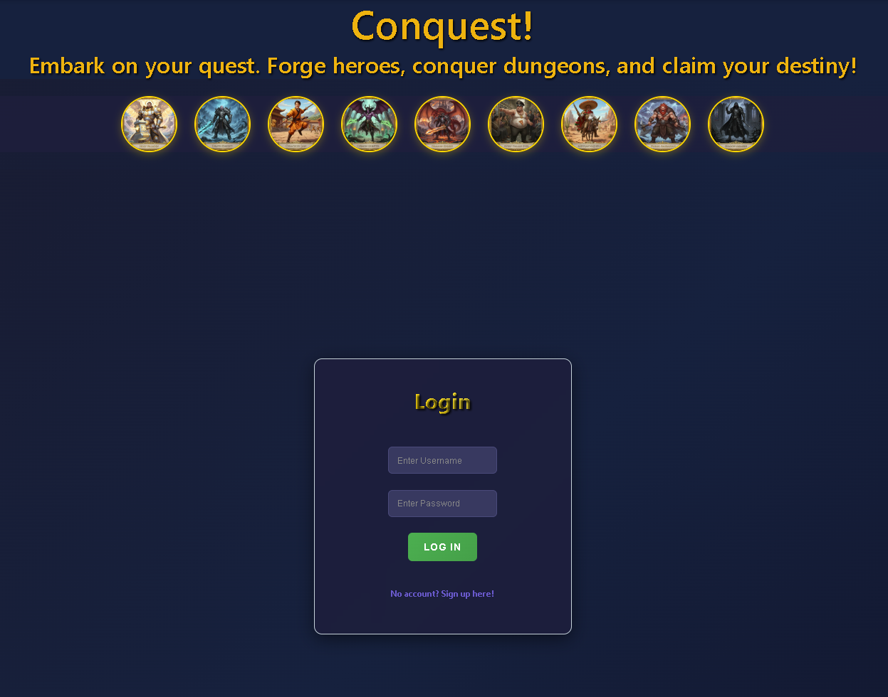

  

# Conquest

Conquest is a fantasy combat web application where users create heroes then battle monsters and other players in a dynamic arena. The app features hero management and strategic combat, all wrapped in a modern, interactive UI.

## About the Project

Conquest was built to bring classic RPG combat mechanics to the web, allowing users to experience hero progression, loot collection, and PvE/PvP battles in a streamlined interface. Our team wanted to create a fun, engaging platform for both casual and competitive players, inspired by classic dungeon crawlers and tabletop games.

## Getting Started

- **Repo** [Github Repo](https://github.com/daequansession/Conquest-FrontEnd)
- **Deployed App:** [Conquest Live](https://your-deployed-app-link.com)
- **Planning Materials:** [Project Planning Docs](https://trello.com/b/ZaHKZpcn/ga-unit-4-project)

## Attributions

- [Vite](https://vitejs.dev/) - Build tool
- [React](https://react.dev/) - UI library
- [React Router](https://reactrouter.com/) - Routing
- [Gemini](https://gemini.google.com/app) - Images

## Technologies Used

- JavaScript (ES6+)
- React
- Vite
- CSS Modules
- RESTful API (custom backend)

## Next Steps

- Expand hero classes and add abilities
- Integrate leaderboards and achievements
- Mobile app version
- Enhanced dungeon exploration features (Loot drops!)
